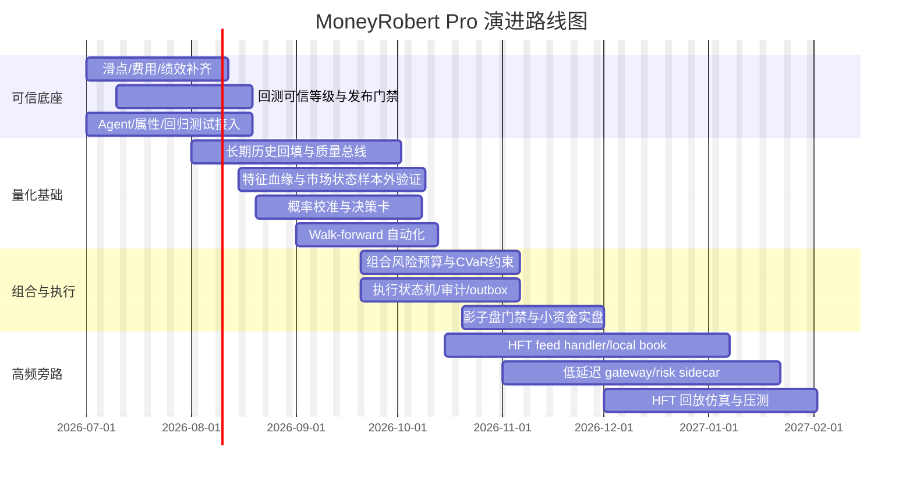

# 投资交易系统设计评估报告

## 执行摘要

基于用户提供的《MoneyRobert Pro 系统评估与演进规划》，当前系统已经具备“行情 + 特征 + Agent 分析 + 回测 + 模拟盘 + 自动交易 + 风控确认 + 报告”的完整产品骨架，但其现阶段的真实定位仍然更接近**AI 辅助交易工作台 + 确定性风控执行系统**，而不是已经通过严谨统计检验、可证明具备长期稳定正期望的量化交易系统。文档中也明确指出，主要短板并不在前端页面或 Agent 数量，而在于：回测账本与撮合可信度、费用与滑点建模、概率校准、数据血缘与质量、以及仿真/回测/实盘三者语义的一致性。fileciteturn0file0

如果把目标系统拆成两种模式来评估，那么结论非常明确。对**高频量化交易**而言，当前系统**不能满足生产级要求**；原因不是“功能少”，而是缺少高频生存所需的基础设施能力，包括二进制协议行情、毫秒以下确定性执行路径、局部订单簿、时钟同步、低抖动网络、流控/幂等/重放、以及可审计的逐笔事件账本。交易所原始文档显示，主流高性能市场接口普遍围绕订单级或深度级数据、严格的时序、低层原生协议和高带宽链路设计：例如 Nasdaq TotalView-ITCH 提供订单级深度、以顺序消息传播，FPGA 版本甚至要求 10Gb 或 40Gb 接入；Nasdaq OUCH 被定义为“低层原生协议”，以性能优先；Binance 现已提供 SBE 二进制市场数据流、微秒时间戳与 25ms 深度增量；Coinbase 也明确要求消费者处理 sequence gap/out-of-order，并建议使用可保证投递一致性的 level2 通道维护本地订单簿。citeturn10view0turn12view0turn12view3turn7view0turn26view0turn26view2

对**中低频量化交易**而言，当前系统**具备研究与影子盘的基础，但仍不足以直接承担“稳定盈利”的实盘目标**。原因在于：文档虽已显示撮合反手、基础绩效指标、特征仓库、市场状态识别与 API 路由等能力已启动或部分完成，但滑点成本仍返回 0、Alpha/Beta/CVaR/回撤持续期尚缺、Agent 测试未全面接入、长期历史与数据质量体系不足、Walk-forward 和概率校准未完成。这意味着系统可以支撑**策略研究、候选信号生成、有限自动化执行**，但还不足以支撑“以统计显著性和稳健风控为前提的资金放大”。fileciteturn0file0

还需要先说明一个原则性判断：**不存在能够保证“稳定盈利”的交易系统**。现实中能被设计出来的，是一个在明确市场、容量、成本和风险预算前提下，尽量形成**长期正期望、成本后仍可存活、在市场状态变化时可自我降杠杆或停机**的系统。对这一点，学术与实务界长期强调回测过拟合风险；仅以漂亮的样本内收益或单一 Sharpe 做上线依据，往往会把噪声误判为 Alpha，因此必须结合多重检验修正、样本外验证和风险尾部约束。citeturn23academia0turn23search4

本报告的核心建议是：**MoneyRobert Pro 的最佳演进路径不是直接冲刺“真 HFT”，而是先把现有系统收敛为可验证的 MLF 生产底座，再在独立旁路上建设 HFT-lite / 做市化微结构引擎。** 换句话说，应该采取“双轨制”架构：保留现有 Rust/数据库/API 体系作为中低频研究、组合管理与风控中枢；同时把高频链路独立成二进制行情、本地订单簿、低抖动执行和事件回放专用栈。这样既尊重当前代码基线，也符合交易基础设施演进的技术规律。fileciteturn0file0turn7view0turn10view0turn18view3

最后说明假设使用情况。用户提示中给出的默认假设是“文档包含当前系统设计说明、架构图与性能测试结果”；但本次实际提供的文本更像一份**代码核验后的系统评估与演进设计摘要**，包含代码路径、完成度、目标架构原则与实施路线图，却**没有给出可复核的端到端延迟、吞吐压测表**。因此，本报告**没有使用“存在性能测试结果/架构图”的默认假设**，凡涉及延迟与吞吐数字的部分，均按行业基线给出建议目标，而不是对现网已实现能力的确认。fileciteturn0file0

## 文档解构与当前系统评估

### 当前系统架构、流程与已实现能力

从文档可提炼出，当前系统的实际形态是一个偏**模块化单体**的交易平台，后端至少包含 Rust 的回测引擎、绩效引擎、特征模块、路由层、Agent 模块以及数据库迁移脚本；文档建议的目标架构是六层分离：**Market Data → Feature Store → Model/Signal → Portfolio/Risk → Execution → Attribution**。同时，文档明确要求 LLM/Agent 仅负责候选信号、证据摘要和解释，不能直接拥有实盘执行权；实盘风控与执行必须由确定性代码完成；仿真、回测、影子模式和实盘应共享同一套撮合、费用、滑点和仓位语义。fileciteturn0file0

就交易流程而言，当前系统已经覆盖了从数据分析到下单闭环的大部分“业务步骤”：行情与技术分析输入、Agent 辩论、市场状态识别、候选信号生成、风险确认、模拟盘/回测、自动交易、报告与归因。但它仍缺少“可量化检验”的关键折返点：一是对信号质量的样本外统计验证；二是对执行质量的真实成本归因；三是把 Portfolio/Risk 层从“主观置信度调仓”升级为“风险预算 + 成本约束 + 市场容量约束”的确定性优化。fileciteturn0file0

文档给出的已实现能力相对清晰。撮合与账户记账方面，`matching_engine.rs` 已实现反向平仓、反手开新方向仓位、开仓/加仓/平仓/反手单元测试；绩效引擎已从日末权益计算 Sharpe，并新增 Sortino 与 Calmar；报告 API 已按 `user_id` 做隔离；特征仓库新增了 `feature_definitions`、`feature_values`、`market_regimes`、`ohlcv_daily` 表及对应 API；市场状态识别已提供五类状态；`/features` 已完成路由挂载。与此同时，文档明示：滑点成本仍为 0、Alpha/Beta/CVaR/尾部风险/回撤持续期缺失，Agent 测试资产尚未清洗与纳入 Cargo，长期数据回填与数据血缘/质量体系未完成，Walk-forward 和概率校准未完成。fileciteturn0file0

文档还对阶段完成度做了直白判断：第一阶段“可信底座”约完成 65%，第二阶段“量化基础”约完成 25%。这意味着当前系统并非“几乎能跑实盘，只差一点”，而是**底座已经开始正确化，但距离可验证的生产量化系统仍有相当距离**。特别是文档多次强调：在撮合、滑点、费用、绩效指标与测试门禁未补齐之前，回测结果不应作为自动晋级实盘的依据。就投资交易系统而言，这是最关键、也最正确的工程态度。fileciteturn0file0

### 当前系统提取结果与满足度判断

下表基于文档内容，提取当前系统的可确认现状，并分别判断其对 HFT 与 MLF 的满足度。

| 维度 | 文档提取 | 对 HFT 的判断 | 对 MLF 的判断 | 依据 |
|---|---|---|---|---|
| 系统定位 | AI 辅助交易工作台 + 确定性风控执行系统 | **不满足**。HFT 不接受 Agent 解析链路置于主路径 | **部分满足**。可作为研究与交易协同工作台 | fileciteturn0file0 |
| 架构层次 | 目标六层：数据、特征、信号、组合风控、执行、归因 | **方向正确但实现不足** | **方向正确，适合继续沿现架构演进** | fileciteturn0file0 |
| 撮合与账本 | 已修复反手/平仓逻辑并有基础测试 | **远不足**，缺逐笔、队列、撮合细则、低延迟事件账本 | **基本可继续增强**，但仍需随机序列与杠杆保证金测试 | fileciteturn0file0 |
| 绩效指标 | Sharpe/Sortino/Calmar 已有；滑点成本仍为 0；CVaR/Alpha/Beta 缺失 | **不满足** | **不满足生产，满足研究早期** | fileciteturn0file0 |
| 数据与特征 | 已有特征仓库、market regime、日 OHLCV；无长期回填、无订单簿/逐笔、无血缘质量 | **不满足** | **部分满足**，但样本外与长期稳定性不足 | fileciteturn0file0 |
| 风控 | 已有风险确认；文档建议改为风险预算、Fractional Kelly、CVaR、组合约束 | **不满足** | **部分满足**，需要从规则风控升级到组合风控 | fileciteturn0file0 |
| 执行与审计 | 文档建议幂等 key、outbox、状态机、影子模式、执行审计日志 | **当前未见完整实现** | **当前未见完整实现** | fileciteturn0file0 |
| 测试门禁 | 核心测试已开始，但 Agent 测试未完全接入；属性测试和样本外验证不足 | **不满足** | **不满足上线门槛** | fileciteturn0file0 |
| 延迟/吞吐 | 文档未提供可复核的端到端压测数据 | **无法认定**，默认不满足 | **无法认定**，仅能认为研究链路可跑 | fileciteturn0file0 |

综合判断可以直说：**当前系统对 HFT 的可用度约为 15–25/100，对 MLF 的可用度约为 40–55/100。** 这个评分不是外部标准分，而是本报告根据文档完成度、缺失项性质与交易系统行业基线所做的工程评估。其含义是：HFT 还处于“概念与组件可迁移”阶段；MLF 已进入“研究/影子/小额试运行准备期”，但距离“稳定盈利”仍差一个严谨的验证与治理闭环。fileciteturn0file0turn23academia0turn18view3

## 高频量化交易模式设计

### 目标、盈利假设与适用边界

HFT 在这里不应被理解为“只要更快地下单就能赚钱”，而应理解为围绕**微结构信号、订单簿状态、撤挂单队列位置、跨市场微价差和做市库存控制**来构建的低延迟系统。它的盈利来源通常不在大级别方向判断，而在短周期内反复提取极小的边际优势；因此，盈利假设必须建立在三个前提上：第一，能接收到足够细粒度的盘口或逐笔数据；第二，能以稳定且可控的低抖动路径下单与撤单；第三，费用、滑点、冲击成本、撤单比与库存风险都被纳入同一个实时控制框架。Nasdaq ITCH/OUCH 直接反映出这一逻辑：一个负责订单级市场数据，一个负责极限性能订单接入；Binance 和 Coinbase 的官方文档则说明，即使在加密市场，想做高频也必须围绕 sequence、局部订单簿一致性、二进制/低开销数据、以及故障切换设计。citeturn10view0turn12view0turn12view3turn7view0turn26view0turn26view2

因此，对 MoneyRobert Pro 而言，更实际的目标不是“一步到位做真 HFT”，而是区分成两档。第一档是**HFT-lite**：面向加密交易所公开互联网接口，通过 SBE/FIX/Direct Feed + 本地订单簿 + 低抖动机房部署，争取做到毫秒级决策与毫秒到十毫秒级执行；第二档才是**交易所近场/共址 HFT**：仅在目标市场提供真正原生低延迟设施时才值得建设。后者是重资产工程，不应与现有产品主链路混在一起。这个边界非常重要，因为如果没有近场网络与确定性执行，所谓“HFT”往往只是把中低频策略跑得更忙，最后只会把手续费和滑点放大。citeturn10view0turn12view0turn7view0turn6view1

### 高频模式的目标设计

下表给出 HFT 模式的推荐设计。表中延迟与吞吐是**建议目标**，不是对当前系统的现状认定。

| 设计项 | 建议方案 |
|---|---|
| 目标与盈利假设 | 以做市、盘口不平衡、短时均值回复、跨市场价差、资金费率微结构失衡为主要 Alpha；单笔边际优势极小，必须在净成本后仍为正，且依赖高成交频率、低拒单率和低库存波动。该模式不追求“看方向”，而追求“价格发现链条中更快更稳的反应”。citeturn10view0turn12view0turn7view0 |
| 数据采集 | 主采集链路应优先使用二进制或直连市场数据；加密场景可优先 Binance SBE 与 Coinbase Direct/level2 组合，维护本地订单簿并持续校验 sequence gap。citeturn7view0turn26view0turn26view2 |
| 行情订阅 | 每个 venue 独立 feed handler；一个 `feed-normalizer` 只做协议解析与时间戳标准化，不做策略逻辑；所有 gap、乱序、重连都发事件入日志与告警。Coinbase 明确要求消费者处理 dropped messages/out-of-order；Binance 明确存在 24 小时连接有效期及 `serverShutdown` 事件。citeturn26view0turn26view2turn4view0turn7view0 |
| 策略引擎 | 拆成“微结构特征计算进程 + 库存/报价控制器 + 信号仲裁器”；不允许 LLM/Agent 在主路径上调用。模型只输出报价偏移、挂撤单意图和库存惩罚系数。该约束与文档“LLM 不能直接拥有执行权”的原则一致。fileciteturn0file0 |
| 风控 | 风控必须是前置、确定性、常驻内存：单品种净头寸、全局净敞口、每秒撤单数、每分钟下单量、成交偏离、最大库存、连亏停机、时钟偏差、数据 freshness、sequence gap。监管上，算法交易系统应具备有效系统与风险控制、错误订单防控、阈值/限额、连续测试与业务连续性安排。citeturn18view3 |
| 撮合/下单 | 独立 order gateway；支持幂等 client order id、cancel restrictions、STP、自检下单、状态机与 outbox。Binance 支持唯一 `newClientOrderId`、微秒精度 `recvWindow`、取消约束与测试下单；这些都适合作为工程接口边界。citeturn27view0turn27view2turn27view3 |
| 持仓与清算 | 采用事件溯源账本，实时维护现金、冻结保证金、已实现盈亏、未实现盈亏、队列中的订单风险占用；日内必须能在毫秒内回答“当前净风险是多少”。文档已有账本语义定义，但要升级到逐笔事件级 HFT 账本。fileciteturn0file0 |
| 回测与仿真 | 必须用订单簿级回放，而不是 K 线回测；至少要模拟盘口深度、撮合优先级、撤单失败、挂单排队、网络抖动和手续费。仅有 bar 级回测无法支撑 HFT。Nasdaq ITCH 的订单级生命周期与 Binance/Coinbase 的深度流设计都说明了这一点。citeturn10view0turn26view0turn7view0 |
| 监控与告警 | 重点监控 feed lag、gap rate、book divergence、p99 gateway latency、reject ratio、cancel/replace 成功率、inventory skew、PnL by venue、CPU cache miss、GC/allocator stall、时钟漂移。 |
| 技术栈建议 | 核心低延迟链路建议 Rust 或 C++；研究与参数搜索可保留 Python；内部消息优先 lock-free ring buffer / shared memory，不建议主路径走常规 Web 请求；协议层采用 SBE/FIX/自定义二进制编解码。该建议来自官方 feed/gateway 的协议形态与当前 Rust 代码基线的折中。citeturn12view0turn7view0turn6view1turn0file0 |
| 硬件/网络需求 | Bare metal 优先，不建议虚拟机；双路高频 CPU、充足 L3、10/25GbE 低时延 NIC、PTP/NTP 基础设施、独立风控机与录制机。若接入类似 Nasdaq FPGA unshaped feed，官方文档要求 10Gb 或 40Gb 连接。citeturn10view0 |
| 延迟与吞吐目标 | 建议内部“行情到决策” p99 < 100–300µs；“决策到发单” p99 < 200–500µs；若为加密 HFT-lite，则“端到端到交易所 ACK”目标应控制在 2–10ms 量级。吞吐目标应达到单机 100k+ msgs/s 解析，峰值可扩展至更高。其合理性来自 Nasdaq 订单级 feed 与 Binance 25ms 深度增量/SBE 微秒时间戳的技术边界。citeturn10view0turn7view0 |
| 容错与高可用 | 双 feed handler、双 ISP 或双专线、主从 gateway、热备风控、写前日志、只增不改事件流、重放恢复、本地 book checksum、主动断路器。Coinbase 推荐 `ws-direct` 主、`ws-feed` 备；Binance 会触发 `serverShutdown` 和 24 小时强制断连，说明高可用必须是协议内建能力。citeturn26view2turn4view0turn7view0 |
| 合规与审计要求 | 必须留存准确、时间有序的订单、撤单、成交、行情快照、风控决策和参数版本。MiFID II Article 17 明确要求算法交易机构保留准确且时间顺序化的订单记录，并在要求时提交。citeturn18view3 |
| 运维与部署流程 | 采用“回放测试 → 仿真 → 影子盘 → 限额实盘 → 扩容实盘”五级门禁；每次发布附带回放样本、基准延迟、回滚镜像与 kill switch 计划。 |

**结论：当前系统不适合直接承载 HFT。** 根本原因不是少几个 API，而是缺少 HFT 必需的“协议、时钟、事件、网络、订单簿、监控、录制、回放”全栈基础设施。现有系统最有价值的部分，是它已经明确了**执行权归属、账本语义、风控确定性和特征/归因分层**；这些原则完全应该被迁移到未来的 HFT 独立链路中。fileciteturn0file0turn10view0turn7view0turn18view3

## 中低频量化交易模式设计

### 目标、盈利假设与适用边界

MLF 模式更适合 MoneyRobert Pro 当前阶段。它的盈利来源不是“抢先几百微秒”，而是通过**更长半衰期的信号**获取收益，例如趋势、波动率状态切换、期限结构、资金费率与持仓量变化、跨市场基差、事件冲击后的延迟反应、以及多因子组合暴露。文档已经为这种演进方向铺了路：特征仓库、市场状态识别、概率决策卡、组合层、风险预算、执行与归因一致性，这些都更贴近成熟的中低频量化生产体系。fileciteturn0file0

从工程上看，MLF 的关键不是把链路“做得像交易所网卡那样快”，而是把系统做成**可验证、可回放、可归因、可降级**。这与文档提出的原则高度一致：信号输出应从主观置信度升级为可校准概率；交易进入实盘前应满足 EV、P(EV>0)、CVaR、数据新鲜度等门槛；回测、模拟盘、影子模式与实盘要共享执行语义；收益展示应默认扣除手续费、滑点、资金费率与冲击成本。只要这些原则落地，MLF 才可能从“会给建议的分析系统”变成“能持续筛选、上线和淘汰策略的量化引擎”。fileciteturn0file0

### 中低频模式的目标设计

| 设计项 | 建议方案 |
|---|---|
| 目标与盈利假设 | 以小时到日频为主，以趋势跟随、均值回复、资金费率/基差、波动率状态切换、事件后漂移和组合因子暴露为核心；收益依赖样本外正期望、成本后稳健性和组合层风险控制，而非单信号命中率。fileciteturn0file0 |
| 数据采集 | 以多交易所 OHLCV、成交、资金费率、持仓量、清算、基差、链上/新闻事件为主；历史覆盖建议不少于两年，并保留原始与标准化双份数据。文档已把这些列为下一步必须补齐的数据面。fileciteturn0file0 |
| 行情订阅 | 实时链路以 WebSocket/REST/批量任务为主即可，不需要把所有业务推到低延迟内存通道；但必须具备 freshness、缺口率和异常值率监控。文档已建议新增 `data_quality_snapshots` 与 `/features/quality`。fileciteturn0file0 |
| 策略引擎 | 推荐采用“研究层 Python + 生产层 Rust”双栈：Python 负责特征实验、Walk-forward、模型拟合和校准；Rust 负责信号服务化、下单、风控与账本。该方案与当前代码基线兼容，也便于逐步减少 AI/Agent 主观性对实盘的干扰。fileciteturn0file0 |
| 风控 | 风控从规则阈值升级为组合治理：风险预算、波动率目标、相关性约束、CVaR、单策略/单市场/单 venue 权重上限、连续亏损停机、当日亏损上限。MiFID II 对算法交易要求阈值、限额、错误订单控制和业务连续性；这些思想虽来自受监管市场，但对 MLF 同样适用。citeturn18view3 |
| 撮合/下单 | 统一使用幂等下单、订单状态机、事件出箱、影子盘门禁与实盘授权；普通 MLF 不必追求微秒级 gateway，但必须追求“状态正确、重复可恢复、异常可重放”。Binance 的唯一 client order id、微秒 `recvWindow`、测试下单接口，都可直接转化为生产安全机制。citeturn27view0turn27view3 |
| 持仓与清算 | 以组合账户为核心，统一现金、已实现/未实现盈亏、资金费率、借贷成本、手续费、滑点、再平衡成本；与回测账本字段一一对应，避免“研究赚、实盘亏”的语义漂移。fileciteturn0file0 |
| 回测与仿真 | 必须使用 Walk-forward / expanding window 验证，禁止一次性长样本调参后直接报告最优结果；应增加 Purged/Embargo 思想或至少做时间切片隔离，并引入多策略试验记录与 Deflated Sharpe Ratio / 过拟合控制。文献与业界长期指出，回测过拟合是量化失败的高频原因。citeturn23academia0turn23search4 |
| 监控与告警 | 重点关注数据 freshness、特征缺失率、模型漂移、校准曲线恶化、订单拒单率、成交偏差、单策略回撤、组合 CVaR、净敞口、因子暴露、策略间相关性上升。 |
| 技术栈建议 | 继续保留 Rust 后端与 PostgreSQL；新增 ClickHouse/Parquet Lake 做时序与特征分析，保留对象存储做原始行情和事件归档；工作流编排建议 Airflow/Temporal，模型注册建议 MLflow 或等价方案。技术栈上优先“研究与生产解耦”，而不是立刻微服务化。 |
| 硬件/网络需求 | 混合云或裸金属均可；研究集群可云化，执行与数据库适合更稳定的专有主机。1–10GbE 足够，重点在稳定、审计和可回放，而不是极限时延。 |
| 延迟与吞吐目标 | 建议“数据到信号”分钟级策略 p99 < 1–5s；小时级策略 p99 < 200–500ms；“信号到发单” p99 < 50–200ms；日内再平衡类对吞吐要求远低于 HFT，但对批量计算、回测并发和可重现性要求更高。 |
| 容错与高可用 | 以任务幂等、数据可重算、特征可回填、信号可回放、订单可对账为主；一旦数据过期、模型失配或校准显著恶化，应触发降级为只减仓/不加仓。文档已将这些门禁方向写得很清楚。fileciteturn0file0 |
| 合规与审计要求 | 至少保留：数据版本、特征版本、模型版本、规则版本、证据时间、下单参数、风控拒绝原因、人工确认痕迹。文档把这一条作为核心约束之一，完全正确。fileciteturn0file0 |
| 运维与部署流程 | 研究环境 → 回测门禁 → 影子盘 → 小资金实盘 → 阶段复盘 → 扩容；每次放量必须经过样本外期、不同市场状态期与异常行情期三类复核。 |

**结论：MLF 是当前系统最应该优先达成的生产目标。** 原因不是 MLF 更“简单”，而是它与当前系统的已有积累同向：特征、状态、解释、组合、风控、报告、审计，这些在 MLF 场景中都能直接产生复利；而在 HFT 场景中，当前系统的大部分上层能力都必须让位于底层基础设施。fileciteturn0file0

### 两种模式的模块对比

| 模块 | HFT 核心要求 | MLF 核心要求 | 当前系统适配性 |
|---|---|---|---|
| 数据采集 | 二进制直连、逐笔/盘口、gap 恢复、本地 book | 多源批量/流式、长期历史、质量监控 | 更接近 MLF |
| 行情订阅 | 微秒/纳秒时间戳、固定时序、低拷贝解析 | 秒级到分钟级 freshness 即可，但必须可追溯 | 更接近 MLF |
| 策略引擎 | 常驻内存、固定延迟、无阻塞、不可调用 LLM 主路径 | 研究-生产解耦、可校准概率、状态分层 | 当前方向明显偏 MLF |
| 风控 | 内存常驻、库存与速率限额、熔断、断路器 | 组合预算、CVaR、相关性、回撤门禁 | 当前更适合演进到 MLF |
| 撮合/下单 | 本地状态机、低抖动 gateway、幂等、重放 | 正确性优先、对账优先、幂等与审计优先 | 现有账本语义适合先做好 MLF |
| 持仓/清算 | 逐笔级别、日内高频更新 | 组合/策略级别，支持再平衡与资金费率 | 当前偏 MLF |
| 回测与仿真 | 订单簿回放、队列位置、网络抖动模拟 | Walk-forward、成本建模、样本外统计 | 当前只到 MLF 早期 |
| 监控与告警 | feed lag、book divergence、latency jitter | 模型漂移、校准恶化、组合回撤 | 当前偏 MLF |
| 容错与高可用 | 主备 feed/gateway、热切换、录制回放 | 任务幂等、数据回填、信号重算 | 当前偏 MLF |

这张表的结论很简单：**当前系统的“交易系统 DNA”是 MLF，不是 HFT。** 若要做 HFT，应新建旁路；若要尽快进入稳定盈利概率更高的区间，应先把 MLF 做实。fileciteturn0file0turn7view0turn10view0turn18view3

## 差距、创新与实施路线图

### 差距清单与优先级

下表把“当前系统是否满足两种模式”转成可执行的缺口清单。优先级采用 P0/P1/P2，P0 表示不补齐就不应实盘放量。

| 差距项 | 当前状态 | 对 HFT 影响 | 对 MLF 影响 | 优先级 | 建议动作 | 依据 |
|---|---|---:|---:|---|---|---|
| 滑点成本未入账 | 仍返回 `0.0` | 致命 | 致命 | P0 | 在成交对象中保存 bps 与金额，绩效 API 默认展示净收益 | fileciteturn0file0 |
| 绩效指标缺 CVaR/Alpha/Beta/回撤持续期 | 缺失 | 高 | 高 | P0 | 扩展 `PerformanceReport`，补单元测试与手算样本 | fileciteturn0file0 |
| 回测门禁不完整 | 文档要求但待落地 | 致命 | 致命 | P0 | 建立“展示/比较/晋级”三级可信等级，未达标禁止上线 | fileciteturn0file0 |
| Agent 测试未完全接入 | 未完成 | 中 | 高 | P0 | 清洗测试资产并纳入 CI，失败即禁发版 | fileciteturn0file0 |
| 长期历史与多维数据不足 | 仅日 OHLCV 与部分 regime | 致命 | 高 | P0 | 回填 2 年以上历史，补 funding/OI/liquidation/basis | fileciteturn0file0 |
| 数据血缘与质量字段不足 | 未完成 | 高 | 高 | P0 | 增加 `feature_lineage`、`data_quality_snapshots` | fileciteturn0file0 |
| 概率校准缺失 | 未完成 | 中 | 致命 | P0 | 增加 Brier、LogLoss、校准曲线与分状态评估 | fileciteturn0file0turn22search7 |
| Walk-forward / 时间切片验证缺失 | 未完成 | 中 | 致命 | P0 | 固化训练/验证/测试切片与自动报告 | fileciteturn0file0turn23academia0turn23search4 |
| 组合风控不足 | 仍带主观置信度痕迹 | 高 | 高 | P1 | 改为风险预算、Fractional Kelly、相关性与 CVaR 约束 | fileciteturn0file0 |
| 执行审计与状态机未完整落地 | 文档为建议项 | 高 | 高 | P1 | 实现 outbox、订单状态机、风险决策日志、执行日志 | fileciteturn0file0 |
| HFT 底层协议与本地 book 缺失 | 未见 | 致命 | 低 | P1 for HFT | 建独立 HFT sidecar：SBE/FIX/level2/local-book | citeturn7view0turn26view0turn10view0 |
| 端到端延迟/吞吐压测缺乏 | 文档未提供 | 致命 | 中 | P1 | 增加基准压测、故障演练、回放压测 | fileciteturn0file0 |
| Drop copy / 二级对账链路不足 | 未见 | 高 | 中 | P2 | 用执行回报流 + 延迟 drop copy 做异步对账 | citeturn6view1 |

从优先级上看，最重要的不是“多做几个 AI Agent”，而是严格执行文档自己提出的收口顺序：**先把账算对、指标算准、数据做全、概率校准、测试接通，再谈资金放大。** 这也是本报告最强烈认同文档的地方。fileciteturn0file0

### 创新设计点与可行性评估

纯照着传统 OMS/EMS 去做，系统会“正确但普通”；纯堆 AI，又会“炫但不可靠”。真正有价值的创新点应该是**增强可验证性、降低过拟合、提高资金利用效率**。结合文档内容与行业主流思路，我建议重点考虑以下设计点。

| 创新点 | 设计说明 | 技术难度 | 成本估算 | 时间线 | 关键风险 | 可行性评估 |
|---|---|---|---|---|---|---|
| 概率决策卡 | 把每次交易变成“概率分布 + EV + CVaR + 失效条件 + 数据血缘”的可审计对象，而非一个主观按钮 | 中 | 中 | 6–8 周 | 概率未校准时会产生伪精确感 | **高**。与文档方向完全一致，且最能提升系统可信度 fileciteturn0file0 |
| 策略晋级三闸门 | 回测可信等级、影子盘样本量、实时校准健康度，三者全过才允许加资金 | 中 | 低 | 4–6 周 | 上线速度变慢 | **极高**。能直接降低“回测漂亮、实盘崩溃”的概率 fileciteturn0file0turn23academia0turn23search4 |
| 数据质量总线 | 每个特征附 freshness、缺口率、异常值率、回填状态和 lineage hash | 中 | 中 | 6–10 周 | 历史脏数据暴露后会影响旧报告 | **极高**。是盈利稳定性而非报表美观的基础 fileciteturn0file0 |
| HFT sidecar | 用独立低延迟链路专做 market data / local book / gateway，不污染 MLF 主系统 | 高 | 高 | 3–6 个月 | 工程投资大、若无容量优势则回报低 | **中等偏高**。适合在 MLF 底座成型后并行孵化 citeturn10view0turn12view0turn7view0 |
| 事件溯源账本 | 所有状态由事件重建，支持任意时间点复盘和风控归因 | 高 | 中 | 2–4 个月 | 迁移复杂 | **高**。对实盘可信度提升巨大 |
| 校准驱动的策略停机 | 一旦 Brier/LogLoss/命中率偏离历史置信区间，系统自动降仓或停机 | 中 | 低 | 4–6 周 | 误杀优质策略 | **高**。比只看 PnL 更早识别失效 fileciteturn0file0turn22search7 |
| 交易后反事实归因 | 对每笔交易同时回答“为何做”“为何错”“若不做/早退会怎样” | 中 | 中 | 6–8 周 | 数据架构若不统一，解释会不一致 | **中高**。更适合 MLF 端先落地 |

在这些创新点里，**“概率决策卡 + 策略晋级三闸门 + 数据质量总线”是性价比最高的一组。** 它们几乎不要求重写交易核心，却能显著提升系统对“伪 Alpha”的免疫力；而 HFT sidecar 则属于第二阶段工程，应在第一组创新完成后再投入。fileciteturn0file0turn23academia0turn23search4

### 实施路线图与里程碑

按这个路线推进，里程碑应这样定义：

| 里程碑 | 验收标准 |
|---|---|
| M1 可信底座完成 | 费用、滑点、CVaR、回撤持续期等指标进入报告；随机成交序列资金守恒测试通过；不可信回测不再可晋级实盘 |
| M2 量化基础成型 | 两年以上主交易对历史覆盖完成；数据质量与特征血缘可查询；概率校准报告可用；Walk-forward 自动化可运行 |
| M3 MLF 生产准备 | 组合风险预算、影子盘门禁、小资金实盘开通；策略有完整决策卡和审计轨迹 |
| M4 HFT sidecar MVP | 独立低延迟行情接入、本地订单簿、低延迟 gateway、回放压测完成，但与主系统松耦合 |

如果执行顺序正确，**第一个真正可能产生稳定收益改进的节点是 M3，而不是 M4。** 也就是说，先把 MLF 做成“统计上可信、风控上可解释、运维上可回放”，再考虑把盈亏曲线进一步用 HFT sidecar 放大。fileciteturn0file0turn23academia0turn18view3

## 盈利稳定性评估与结论

### 风险与缓解措施清单

| 风险 | 触发方式 | 影响 | 缓解措施 |
|---|---|---|---|
| 回测过拟合 | 大量参数试错后只取最好结果 | 样本外失效、资金放大后回撤急剧扩大 | 记录全部试验、使用 Walk-forward、保存 trial ledger、计算 DSR/PBO 类指标、上线前影子盘验证 citeturn23academia0turn23search4 |
| 成本漏算 | 滑点、资金费率、冲击成本未入账 | 纸面盈利、实盘亏损 | 报告默认只展示净收益；按成交保存 slippage_cost；实盘对账回灌回测模型 fileciteturn0file0 |
| 数据污染 | 缺失、回填不一致、未来函数、时间对齐错误 | 信号虚高、不可复现 | 数据质量总线、lineage hash、训练/上线同源、严格时间切片 fileciteturn0file0 |
| 概率失真 | 模型置信度不可校准 | 仓位过大、风险预算错误 | 校准曲线、Brier/LogLoss、分 market regime 校准、策略自动降仓 fileciteturn0file0turn22search7 |
| 执行状态不一致 | 重复下单、状态丢失、重连不正确 | 双重持仓、资金异常 | 幂等 order id、状态机、outbox、drop copy/回报对账、断路器 fileciteturn0file0turn27view0turn6view1 |
| 市场微结构变化 | 交易所限速、接口变更、深度退化 | 高频策略边际消失 | 版本化 venue adapter、每日验活、限速监控、动态下线策略 citeturn4view0turn7view0turn5view4 |
| 合规与可审计不足 | 无法留存时间有序记录 | 审计失败、风控失效、对外说明困难 | 保留时间顺序化订单/撤单/报价/成交/参数/风控记录；必要时导出给监管或券商/交易所 citeturn18view3 |
| HFT 工程投资失衡 | 先重金做低延迟，但 Alpha 半衰期不成立 | ROI 为负 | 先用 MLF 证明研究、风控和归因链条有效，再做 HFT sidecar |

### 预期盈利稳定性评估方法与 KPI

“稳定盈利”不能用一句“过去三个月赚钱了”来判断，而必须用一套同时衡量**统计显著性、尾部风险、执行质量和策略退化速度**的指标体系。建议至少建立四层评估。

第一层是**信号层**。这里看的是预测是否真的有信息增益，而不是只看方向准确率。对分类或离散状态预测，应使用 Brier Score、Log Loss、校准曲线、分状态命中率、分桶收益稳定性；对收益分布预测，应比较 `q10/q50/q90` 与真实分布覆盖率。文档已经把 Brier、LogLoss 和校准曲线列为未完成项，这一判断完全正确。fileciteturn0file0turn22search7

第二层是**策略层**。这里不只看收益，还看收益是否经得起多重试验偏差。至少应跟踪净收益、年化收益、最大回撤、回撤持续期、Sharpe、Sortino、Calmar、CVaR、月度胜率、滚动 63/126 日 Sharpe，以及策略在全部历史 trial 中的相对位置。若做了大量参数搜索或模型搜索，就不应仅看“最佳 Sharpe”，还应结合 Deflated Sharpe Ratio 一类的修正思路评估显著性，并记录完整试验簇。fileciteturn0file0turn23search4turn25academia1

第三层是**执行层**。这里决定了“研究收益能否穿透到实盘”。关键 KPI 包括：成交率、拒单率、超时率、平均/95 分位下单延迟、撤单成功率、挂单队列完成率、实现滑点 vs 预估滑点、交易所 API 限速命中次数、sequence gap 率、book 修复次数。Coinbase 与 Binance 的官方文档都在提醒：市场数据可能丢包、连接有生命周期、接口有严格限速和 session 规则，因此执行层 KPI 必须被当作一等公民，而不是故障时才去排查的技术指标。citeturn26view0turn26view2turn4view0turn7view0turn5view4

第四层是**组合与经营层**。这层看的是系统是否值得扩大资金。核心 KPI 建议如下：

| KPI 组 | 指标 | 推荐门槛思路 |
|---|---|---|
| 盈利质量 | 净收益率、净 Sharpe、净 Sortino、Calmar | 先看净值曲线平滑度，再看单点收益高低 |
| 尾部风险 | CVaR_95、最大回撤、回撤持续期、极端日损失 | 任一指标超预算即停机或降仓 |
| 稳定性 | 滚动 3/6/12 个月 Sharpe、月度胜率、按 regime 分层收益 | 不接受只在单一 regime 有效的“脆弱策略” |
| 容量 | 换手率、成交占市场成交比、盘口冲击、资金放大后滑点弹性 | 资金越大，若净期望衰减过快，则不得扩容 |
| 研究可信度 | Walk-forward 胜率、样本外/样本内比值、试验总数、DSR/PBO | 研究可信度不过关，不得加资金 |
| 运维可靠性 | 任务成功率、回放一致率、订单对账成功率、SLA | 技术可靠性差，会直接转化为交易亏损 |

真正可以称为“盈利稳定性改善”的，不是某个月赚得多，而是：**在多个市场状态下净期望为正、尾部风险始终受控、校准没有持续恶化、执行成本没有吞噬掉 Alpha、而且这些结论能通过回放与审计复现。** 这也是为什么文档把市场状态、特征血缘、概率校准、风险预算和归因放在同一条主线上。fileciteturn0file0

### 最终结论

用一句话总结：**当前系统不能支撑“能够稳定盈利的 HFT”，但有机会演进成“统计上更可信、风险受控、可持续迭代的 MLF 量化交易系统”。** 这不是保守结论，而是对文档内容的忠实工程化翻译。fileciteturn0file0

若问“当前系统是否能够满足需求”，答案应分开说。若需求是**高频量化交易**，答案是**不能满足**；需要新建低延迟旁路，并补足协议、订单簿、时钟、链路、回放与审计全栈能力。若需求是**中低频量化交易**，答案是**部分满足研究与影子盘需求，但不满足‘稳定盈利实盘’需求**；需要把可信底座、量化基础、组合风控与上线门禁做完，尤其是滑点成本、CVaR、长期历史、概率校准与 Walk-forward。fileciteturn0file0turn10view0turn7view0turn18view3

因此，本报告的最终建议很明确：**短中期路线选 MLF，长期路线再孵化 HFT sidecar。** 先把系统修成一个“不会因为账错、指标错、校准错而自欺”的量化底座，再谈追求更高的频率与容量。若执行得当，MoneyRobert Pro 完全有机会从“AI 辅助分析平台”升级为“有实盘纪律的量化交易系统”；但在当前阶段，它离“稳定盈利”仍隔着一条必须严肃完成的工程与统计验证路径。fileciteturn0file0turn23academia0turn23search4